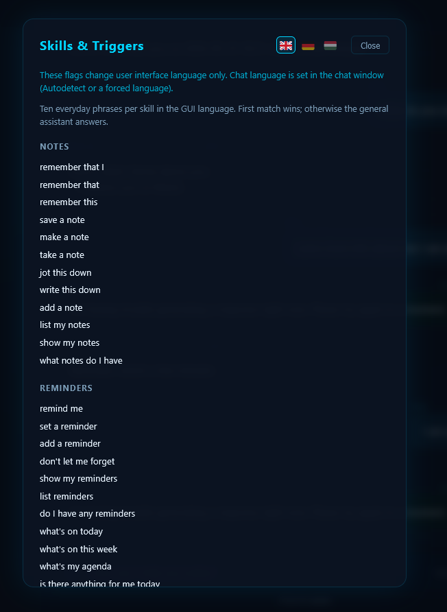
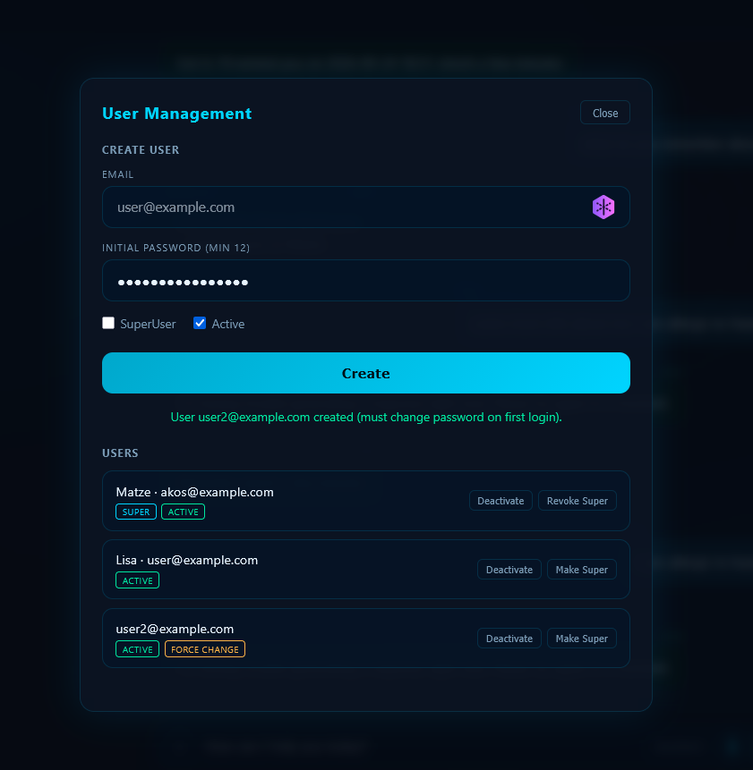
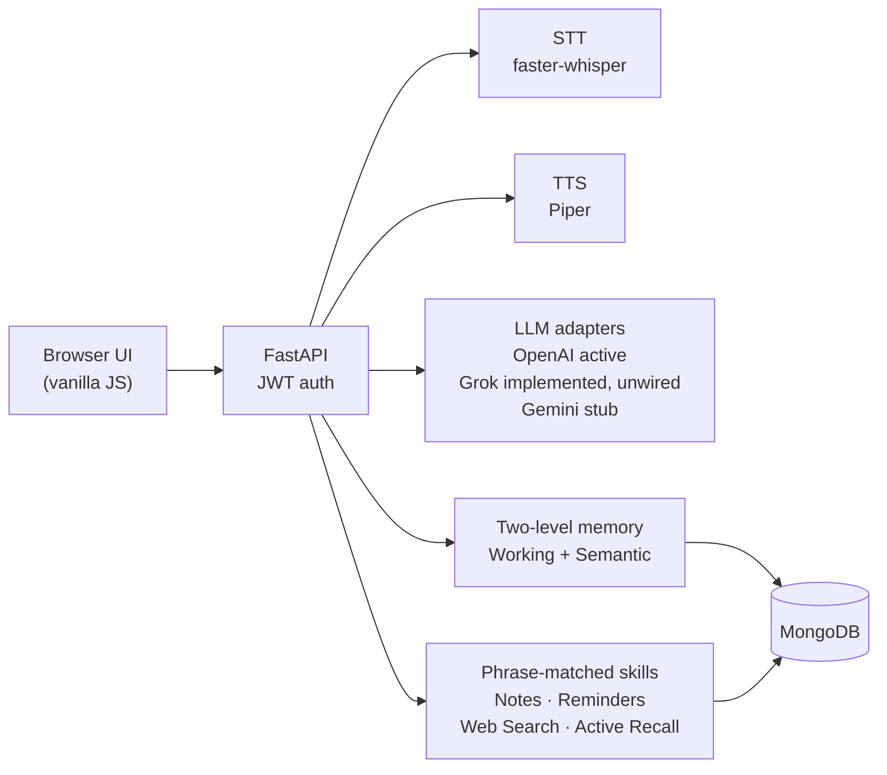

# pa-voice-mvp

**Voice-first personal assistant MVP** (Jarvis-inspired): speak or type in English, German, or Hungarian; get a spoken reply grounded in your own notes, reminders, and two-level memory.

**Status:** MVP complete, demo 18.09.2026

[](https://github.com/ANY1-hub/pa-voice-mvp/actions/workflows/ci.yml)

## Screenshots



Skills & Triggers overlay: phrase-router trigger phrases per skill (UI in English, German, Hungarian).



Admin user management with demo accounts (example.com addresses only).

## Architecture



## Features

- Voice interaction (STT + TTS) with visible transcript and reply
- Working Memory + Semantic Memory with background consolidation
- Multi-user isolation (JWT); SuperUser bootstrap and admin panel
- Multi-language UI and TTS voices (en / de / hu)
- Skills: Notes, Reminders (date-aware + agenda), DuckDuckGo Web Search, Active Recall
- Honest fallbacks when LLM / skill / STT paths fail (no internal error leakage)

## Stack (honest)

| Layer | Choice |
|-------|--------|
| Backend | FastAPI |
| Database | MongoDB (local Docker or Synology NAS) |
| STT | faster-whisper |
| TTS | Piper (multi-voice) |
| LLM (current) | OpenAI active; Grok adapter implemented (xAI via OpenAI SDK) but not wired in `src/api/deps.py`; Gemini stub (`NotImplementedError`) |
| Auth | JWT + bcrypt |
| Frontend | Vanilla JS + static HTTP |

Local LLM via Ollama is on the roadmap, not in this MVP.

## Getting started

```bash
git clone https://github.com/ANY1-hub/pa-voice-mvp.git
cd pa-voice-mvp

uv sync --extra dev
# Windows: .venv\Scripts\activate   Linux/macOS: source .venv/bin/activate
playwright install chromium

cp .env.example .env
# Set MONGODB_URI and a SECRET_KEY of ≥64 random characters.

uvicorn src.main:app --reload --host 0.0.0.0 --port 8000
```

Frontend (second terminal):

```bash
cd frontend
python -m http.server 5500
# Open http://127.0.0.1:5500 — UI talks to the API on :8000
```

Piper voice models are not in the repo; see [docs/piper-voice-setup.md](docs/piper-voice-setup.md). Mongo options: `docker-compose.yml` or [docs/nas-mongodb-setup.md](docs/nas-mongodb-setup.md).

## Tests

```bash
uv run pytest
```

CI enforces a **90%** coverage floor (`--cov-fail-under=90`).

## API

Endpoint tables live in **[docs/api.md](docs/api.md)** (auth, admin, chat, notes, reminders, skills, memory).

## Security & privacy

- Tenant isolation on every memory and chat route (JWT `user_id`, never a client-supplied id)
- Passwords: bcrypt; lengths over 72 UTF-8 bytes are rejected, not truncated
- Login rate limit; no weak / placeholder `SECRET_KEY` at startup
- Personal memory context is labelled in the system prompt as untrusted user data (not instructions) before the LLM sees it — a prompt label is not a hard control
- Prompt-injection blocklist is a UX heuristic, not a security boundary
- CORS allow-list for the Voice UI origins; health check never returns secrets

## Limitations

- OpenAI is required for the general chat path; skills that do not need an LLM still run without a key
- No streaming replies, no local LLM in this release, no GDPR data-rights UI
- Semantic search ranks in-process (cosine / text); native Mongo `$vectorSearch` is deferred
- Phrase-matched skills, not an LLM skill router

## Roadmap

- Local LLM (Ollama) behind the existing adapter
- Full spotlighting (per-call random delimiter + datamarking) and stronger grounding / output guards (see `docs/decisions/004-grounding-and-guards.md`)
- Wire the existing Grok adapter in `src/api/deps.py` (optional provider)
- Episodic / perceptual memory levels after the two-level MVP
- Streaming, GDPR export/delete UI, Home Assistant

## Capstone context

Built as a capstone project at the **Masterschool Institute of Technology**, programme **Software Engineering with AI**.

## How this was built

AI-assisted, test-driven development with separate roles for writing tests, implementing product code, and reviewing architecture / security / docs. Slice briefs and coverage gates (90%) keep changes honest. No private tooling names belong in the public docs.

## License

MIT — see [LICENSE](LICENSE). Copyright (c) 2026 Ákos Nyíry.
